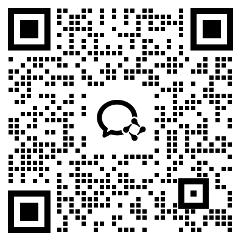
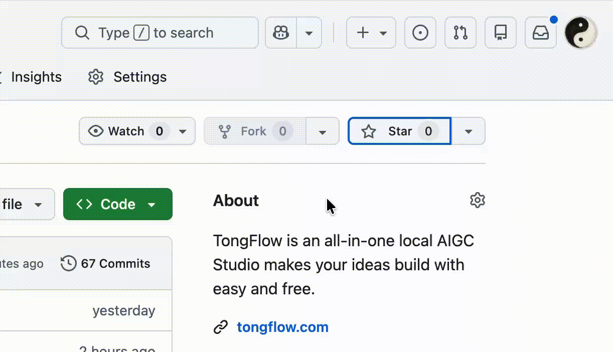

<div align="center">
  

  <h1>TongFlow : An Open-Source Multi-Modal GenAI Workflow Studio</h1>
  <p>
    <a href="https://github.com/tong-io/tongflow/stargazers"></a>
    <a href="https://github.com/tong-io/tongflow/blob/main/LICENSE"></a>
    <a href="https://github.com/tong-io/tongflow/actions/workflows/ci.yml"></a>
    <a href="https://pypi.org/project/tongflow/"></a>
    <a href="https://discord.gg/K7V8az94Zf"></a>
    <a href="https://github.com/tong-io/tongflow/releases"></a>
  </p>
  <p>
    <video src="https://github.com/user-attachments/assets/407a7e7b-2d44-4c90-8016-33d0a9f5e7d5"></video>
  <p>
  <p>
    <strong>English</strong> · <a href="docs/README_ZH.md">简体中文</a> · <a href="docs/README_JA.md">日本語</a>
  </p>
</div>


## Demo Examples

| Workflow | Result |
| :--: | :--: |
| **Basic** — Type text (Add), generate images (Transform), then blend them into one (Compose).<br/> |  |
| **Intermediate** — (Add topic → write script → generate speech) + (character description → generate image) → lip-synced video = talking-head avatar.<br/> | <video src="https://github.com/user-attachments/assets/a803394d-0ccf-4023-9b06-5c1581345758" width="200"></video> |
| **Advanced** — Generate lyrics + song + characters + scenes + storyboard → produce a music video.<br/> | <video src="https://github.com/user-attachments/assets/2bc71e3c-3ed6-48b2-81e7-82ad5976d801" width="200"></video> |

With TongFlow, you can expand your imagination and stretch your ideas with generative AI, just have a try now!

## How To Start

We provide a ready-to-run TongFlow **desktop app**.

### Step 1 — Install the desktop app

Download the installer for your platform, install it, and open it.

- **macOS (Apple Silicon):** [TongFlow-mac-arm64.dmg](https://github.com/tong-io/tongflow/releases/latest/download/TongFlow-mac-arm64.dmg)
- **macOS (Intel):** [TongFlow-mac-x64.dmg](https://github.com/tong-io/tongflow/releases/latest/download/TongFlow-mac-x64.dmg)
- **Windows:** [TongFlow-win-setup.exe](https://github.com/tong-io/tongflow/releases/latest/download/TongFlow-win-setup.exe)

All builds are on the [Releases](https://github.com/tong-io/tongflow/releases/latest) page.

> **macOS:** the builds are not yet notarized with Apple, so Gatekeeper will block the first launch ("TongFlow is damaged and can't be opened"). After moving the app to Applications, clear the quarantine flag once and it opens normally:
>
> ```bash
> xattr -cr /Applications/TongFlow.app
> ```
>
> Download from this page directly — installers passed through chat apps (e.g. WeChat) may be renamed or re-flagged.

On first open, the canvas is preloaded with an example workflow — the next steps get it ready to run.

### Step 2 — Install plugins

The app ships with no plugins pre-installed. Open the **plugin manager** (the blocks icon, top-right) and install what you need. Newly installed plugins are usable immediately, no restart.

To run the preloaded **example workflow** (text → image → fusion → video), install these three plugins:

- [tongflow-modal-z-image](https://github.com/tong-io/tongflow-modal-z-image) — text-to-image
- [tongflow-modal-flux2-klein9b](https://github.com/tong-io/tongflow-modal-flux2-klein9b) — image fusion / blending
- [tongflow-modal-ltx](https://github.com/tong-io/tongflow-modal-ltx) — image-to-video

These run on [Modal](https://modal.com) (up to **$30/month** of free GPU compute). Add `MODAL_TOKEN_ID` / `MODAL_TOKEN_SECRET` in **Settings**; create a token at [modal.com/settings/tokens](https://modal.com/settings/tokens). Any other platform can publish its own plugins the same way.

Browse the full catalog — the official API plugins (OpenAI / Gemini / OpenRouter) and other GPU/CPU plugins — in the plugin manager.

### Step 3 — Configure credentials

Open **Settings** (the gear icon, top-right) and add the environment variables your plugins need — e.g. `OPENAI_API_KEY` for the API plugins, or the credentials your GPU/CPU plugins require.

> **Plugin credentials live in Settings.** TongFlow is platform-agnostic and hardcodes no provider: the Settings dialog is a generic key/value editor for environment variables passed to plugins. Each plugin's README documents the keys it needs. Values are stored locally and take effect without a restart.

### Step 4 — Run the example workflow

Run the preloaded example node by node, or switch to Execute Mode and hit the run button to run the whole thing in one click.

## Core Concept

- **All models**: AI models can be thought of as a **modality transform** (e.g. LLMs are text→text, image models are text→image, speech models are text→audio, and so on). TongFlow wraps each capability as a node.

- **All modalities**: TongFlow supports almost every modality and file format that people actually ship over the web.

- **Low barrier, high ceiling**: no complex AI parameters to learn, no manual node connecting; just three operations — **add**, **transform**, and **combine** — to arrange ideas freely. And by orchestrating AI models freely, you can generate unique creations and works of your own.

- **Open ecosystem**: TongFlow's plugin-based design lets every platform package its own independent plugins, and we provide at least one official implementation plugin for each capability node. The core stays small, the ecosystem stays open.

## What’s Defined

> ✅ = available out of the box with an official plugin · ⬜ = node exists in the canvas but has no official plugin yet (planned).

### Add

- ✅ **Text input**: type text and add a text node.
- ✅ **Add image**: pick a local file and add an image node.
- ✅ **Add photo**: capture with the device camera and add an image node.
- ✅ **Add sketch**: draw on the canvas and add an image node.
- ✅ **Add audio**: pick a local audio file and add an audio node.
- ✅ **Record audio**: record with the mic and add an audio node.
- ✅ **Add video**: pick a local video file and add a video node.
- ✅ **Record video**: record with the camera and add a video node.
- ✅ **Add document**: pick a local file and add a document node.
- ✅ **Add URL**: fetch a page from a link and add text, image, audio, or video nodes.
- ✅ **Add 3D model**: choose a local model file and add a 3D model node.

### Transform

#### Text

- ✅ **Generate / rewrite**: create or edit copy from a prompt.

#### Image

- ✅ **Image generation**: images from text.
- ✅ **Image editing**: inpaint, edit, or redraw with instructions.
- ✅ **Image understanding**: captions, Q&A, or descriptions from an image.
- ✅ **Image upscaling**: enlarge for sharper detail.

#### Video

- ✅ **Video generation**: video from text.
- ✅ **Image-to-video**: animate a still into motion.
- ✅ **First/last-frame video**: two key images to interpolate a clip.
- ✅ **Video understanding**: summaries or descriptions from video.
- ✅ **Video upscaling**: higher-resolution output.
- ✅ **Extract first / last frame**: grab a frame as an image.
- ⬜ **Subtitle removal**: clean subtitles from a video.
- ⬜ **Watermark removal**: remove watermarks from a video.

#### Audio

- ✅ **Music generation**: music from text.
- ✅ **Speech synthesis**: text-to-speech — preset style, voice clone (reference audio), or instruction-driven.
- ✅ **Speech recognition**: transcribe speech from audio or video.
- ⬜ **Noise reduction**: denoise audio.
- ⬜ **Speaker diarization**: separate audio by speaker.
- ⬜ **Voice / timbre replacement**: replace or clone a voice with a reference sample.
- ⬜ **Multi-track / vocal-accompaniment separation**

### Combine

- ✅ **Image fusion**: blend or edit multiple references into one image.
- ✅ **Lip sync**: audio + video → video (lip-sync); also audio + image → video and audio + text → video variants.
- ✅ **Character swap**: video + reference (scene blend / character replacement), Animate Mix-style generation.
- ✅ **Motion transfer**: video + reference (motion / retarget), Animate Move-style generation.
- ✅ **Combine text**: merge multiple text nodes into one.

### Other

- ✅ **Image → 3D**: single-view 3D model from an image.
- ✅ **Document → text**: extract plain text from documents.
- ✅ **Link → text**: turn page content into text.

### Helpers

- ✅ **Concatenate clips**: join multiple videos end to end.
- ✅ **Mux audio + video**: merge into one file.
- ✅ **Split by shots**: cut a long video into segments by scene.
- ✅ **Split video & audio**: demux a video into separate video and audio tracks.
- ✅ **Extract audio track**: pull audio into its own asset.
- ✅ **Split long text**: break a long passage into chunks.
- ✅ **Merge / tidy text blocks**: combine segments (use the auto-merge option).
- ✅ **Filter or drop clips**: drop unwanted clips by rule or selection.
- ✅ **Arrange & batch groups**: group and arrange text/clip batches for downstream processing.

## Official plugins

> The official GPU/CPU plugins currently run on [Modal](https://modal.com) — up to **$30/month** of free GPU compute (H100/A100, etc.). See [Step 2](#step-2--install-plugins) for the `MODAL_TOKEN_*` setup. Any other platform can publish its own plugins the same way.

### API plugins

- [tongflow-api-openrouter-free](https://github.com/tong-io/tongflow-api-openrouter-free) — default `gen_text` route via OpenRouter's free models
- [tongflow-api-gemini](https://github.com/tong-io/tongflow-api-gemini) — Google Gemini for `gen_text` and other Gemini multimodal handlers
- [tongflow-api-openai](https://github.com/tong-io/tongflow-api-openai) — OpenAI for `gen_text`

### GPU/CPU plugins

- [tongflow-modal-ffmpeg](https://github.com/tong-io/tongflow-modal-ffmpeg) — transcoding, muxing, media pipelines
- [tongflow-modal-pyscenedetect](https://github.com/tong-io/tongflow-modal-pyscenedetect) — shot-boundary detection for splitting clips
- [tongflow-modal-z-image](https://github.com/tong-io/tongflow-modal-z-image) — Z-Image text-to-image
- [tongflow-modal-ernie-image](https://github.com/tong-io/tongflow-modal-ernie-image) — ERNIE Image text-to-image (alternative)
- [tongflow-modal-flux2-klein9b](https://github.com/tong-io/tongflow-modal-flux2-klein9b) — FLUX.2 Klein 9B multi-reference fusion / image editing
- [tongflow-modal-ltx](https://github.com/tong-io/tongflow-modal-ltx) — LTX-2.3 text / image-to-video
- [tongflow-modal-infinitetalk](https://github.com/tong-io/tongflow-modal-infinitetalk) — InfiniteTalk audio-driven lip-sync (audio + video → talking-head video)
- [tongflow-modal-wan-animate](https://github.com/tong-io/tongflow-modal-wan-animate) — Wan-Animate character swap & motion transfer (video + reference)
- [tongflow-modal-scail2](https://github.com/tong-io/tongflow-modal-scail2) — SCAIL-2 controlled character animation (image + driving video; same two slots as wan-animate)
- [tongflow-modal-triposplat](https://github.com/tong-io/tongflow-modal-triposplat) — TripoSplat single image → 3D Gaussian splat
- [tongflow-modal-seedvr2](https://github.com/tong-io/tongflow-modal-seedvr2) — SeedVR2 image / video super-resolution
- [tongflow-modal-gemma4](https://github.com/tong-io/tongflow-modal-gemma4) — Gemma-4 multimodal text (image / video understanding)
- [tongflow-modal-qwen3asr](https://github.com/tong-io/tongflow-modal-qwen3asr) — Qwen3 speech recognition
- [tongflow-modal-qwen3tts](https://github.com/tong-io/tongflow-modal-qwen3tts) — Qwen3 text-to-speech
- [tongflow-modal-whisper](https://github.com/tong-io/tongflow-modal-whisper) — Whisper speech recognition with timestamps (alternative)
- [tongflow-modal-ace-step](https://github.com/tong-io/tongflow-modal-ace-step) — ACE-Step text-to-music
- [tongflow-modal-docling](https://github.com/tong-io/tongflow-modal-docling) — Docling document → text
- [tongflow-modal-paddle](https://github.com/tong-io/tongflow-modal-paddle) — PaddleOCR document → text
- [tongflow-modal-crawl4ai](https://github.com/tong-io/tongflow-modal-crawl4ai) — Crawl4AI URL / link → text

## Run from source

```bash
pnpm install
pnpm plugins:install   # clone official plugins into plugins/
pnpm start:prod        # builds once, then serves at http://localhost:3000
```

Requires **Node** (with `pnpm`) and a **Python 3.10+** interpreter on your `PATH` (set `PYTHON` to point at a specific one). Plugins run as local Python processes; TongFlow provisions an isolated venv for them automatically and installs each plugin's `requirements.txt` on first use — no manual Python setup.

Open **`http://localhost:3000`** and the canvas is live. Install/configure plugins exactly as in Steps 2–4 above (credentials go in the in-app **Settings** dialog, or a project `.env`).

## Run with Docker

A self-host image is published to GHCR — no Node/Python/pnpm setup required:

```bash
docker run -d -p 3000:3000 \
  -v tongflow-data:/data -v tongflow-plugins:/plugins \
  ghcr.io/tong-io/tongflow:latest
```

Then open **`http://localhost:3000`**. Or with Compose (clones this repo's [`docker-compose.yml`](docker-compose.yml)):

```bash
docker compose up -d
```

To build the image yourself instead of pulling: `docker build -t tongflow .`

**Data & credentials.** Everything writable lives in the `/data` volume (SQLite db, uploads, settings). API keys are optional — set them in the in-app **Settings** dialog, or pass them at launch (`-e OPENROUTER_API_KEY=…`); supported keys: `OPENROUTER_API_KEY`, `GEMINI_API_KEY`, `OPENAI_API_KEY`, `MODAL_TOKEN_ID` / `MODAL_TOKEN_SECRET`.

**Plugins.** The image ships no plugins — install them from the in-app plugin manager (first install needs network access to GitHub). On first run, a plugin provisions a shared Python venv under `/data/.tongflow/plugin-venv` (installs the SDK + the plugin's `requirements.txt` from PyPI), so the first run is slower and needs network. Modal-backed plugins additionally need a Modal token.

## Custom plugins

Every runnable node is backed by a **contract** — the ABI ([`config/tongflow.abi.json`](config/tongflow.abi.json)) — that defines *what capabilities exist* and *what each one's input/output looks like*, independent of *who* implements it. A plugin is just a small Python package that picks one or more ABI slots and supplies the **how**, annotated against the ABI-generated types via the tongflow Python SDK.

The full development flow — the ABI, the `@node_slot` decorator, the SDK, directory layout, and how to publish — lives in **[docs/plugins.md](docs/plugins.md)**.

## Community

Join the community on **[Discord](https://discord.gg/K7V8az94Zf)** or scan the **WeChat group** QR code below.

<div>
  
</div>

## Business

For business inquiries, please contact business@tongflow.com.

- **Open-source model owners**: I can integrate your models so users can try them out smoothly.
- **Enterprise**: I can help you deploy on your local GPU, build custom nodes and plugins, and more.
- **Platform / router**: I can integrate your APIs.
- **VCs**: I’m interested in partnering on [tongflow.com](https://tongflow.com), a cloud-hosted AI studio.

## Open-Source

If you like this project, a Star on GitHub helps a lot. Thank you.



## License

TongFlow is **dual-licensed**:

- **[AGPL-3.0](LICENSE)** — free for individuals, research, open-source projects,
  and anyone willing to comply with the AGPL (including its Section 13
  network/source-disclosure obligation).
- **[Commercial License](COMMERCIAL-LICENSE.md)** — for organizations that want to
  use TongFlow in closed-source or SaaS products **without** AGPL's
  source-disclosure obligation, or that need warranties and platform support.
  Contact **business@tongflow.com**.

This covers the entire repository, including the `sdk/` directory (the `tongflow`
PyPI package). Contributions are covered by our [CLA](CLA.md).

## Star History

<a href="https://www.star-history.com/?repos=tong-io%2Ftongflow&type=date&legend=top-left">
 <picture>
   <source media="(prefers-color-scheme: dark)" srcset="https://api.star-history.com/chart?repos=tong-io/tongflow&type=date&theme=dark&legend=top-left" />
   <source media="(prefers-color-scheme: light)" srcset="https://api.star-history.com/chart?repos=tong-io/tongflow&type=date&legend=top-left" />
   
 </picture>
</a>
